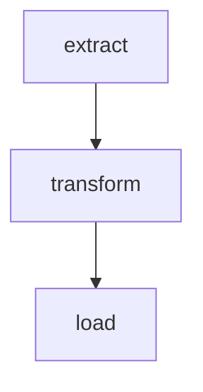

# Databricks Asset Bundle Creator

Generate production-ready Databricks Asset Bundles with modular structure, serverless compute, and automated deployment.

## Quick Start Workflow

1. **Define workflow** via text description, Mermaid diagram, or workflow diagram image
2. **Generate DAB structure** using `scripts/generate_dab.py`
3. **Implement task logic** in `src/` files
4. **Deploy and run** using `run_workflow.sh`

## Input Formats

### 1. Text Description

```
task_name: path/to/file.py
dependent_task: path/to/file.py [depends_on: task_name]
final_task: path/to/final.py [depends_on: task1, task2]
```

Format: one task per line, `task_name: file_path [depends_on: dep1, dep2]`. Comments start with `#`.

### 2. Mermaid Diagram



```bash
scripts/generate_dab.py my_pipeline --mermaid-file workflow.mermaid
```

### 3. Workflow Diagram Image

```bash
scripts/parse_diagram_image.py workflow.png -o tasks.txt
scripts/generate_dab.py my_pipeline -d "$(cat tasks.txt)"
```

Requires: `pip install anthropic` and `ANTHROPIC_API_KEY` env var. Supports PNG, JPG, GIF, WebP.

## Generating the Bundle

```bash
# From text description
scripts/generate_dab.py my_pipeline \
  -d "extract: src/extract.py
      transform: src/transform.py [depends_on: extract]
      load: src/load.py [depends_on: transform]"

# From Mermaid diagram
scripts/generate_dab.py my_pipeline --mermaid-file workflow.mermaid

# With custom options
scripts/generate_dab.py my_pipeline -d "..." \
  --workspace-host "https://my-workspace.cloud.databricks.com" \
  --output-dir ./my_project \
  --no-serverless  # Use clusters instead of serverless
```

## Generated Project Structure

```
my_pipeline/
├── databricks.yml                    # Main bundle configuration
├── resources/
│   └── my_pipeline.job.yml          # Job definition with tasks
├── src/                              # Source code
│   ├── extract.py
│   ├── transform.py
│   └── load.py
├── tests/                            # Unit tests (placeholder)
├── run_workflow.sh                   # Deployment and execution script
└── README.md
```

## Key Configuration Files

### databricks.yml

Defines bundle name, variables (catalog, schema, source_path, checkpoint_path), target environments (dev/prod), and includes `resources/*.yml`.

### resources/*.job.yml

Defines job with serverless environment, task keys, dependencies, notebook paths, and base parameters using `${var.*}` references.

See [sample_databricks.yml](sample_databricks.yml) for a complete example.

## Deployment

```bash
# Using the generated script
./run_workflow.sh --target dev
./run_workflow.sh --target dev --var catalog=my_catalog --var schema=my_schema
./run_workflow.sh --profile my-profile --target prod

# Or directly with Databricks CLI
databricks bundle validate -t dev
databricks bundle deploy -t dev
```

### Script Parameters

| Parameter | Description |
|-----------|-------------|
| `--profile` | Databricks CLI profile |
| `--target` | Deployment target (dev/prod) |
| `--skip-validation` | Skip bundle validation |
| `--skip-deployment` | Skip deployment step |
| `--job-id` | Run existing job by ID |
| `--var` | Override variables (repeatable) |

## Common Dependency Patterns

```
Linear:     extract → transform → load
Parallel:   extract_a ─┐
            extract_b ─┘→ merge → report
Fan-out:    ingest → process_b, process_c, process_d
Diamond:    ingest → feature_a ─┐
                   → feature_b ─┘→ train
```

See [references/examples.md](references/examples.md) for complete examples with generation commands.

## Script Parameters Reference

### generate_dab.py

| Parameter | Required | Description |
|-----------|----------|-------------|
| `bundle_name` | Yes | Name of the bundle/job |
| `-d, --description` | Conditional | Task description |
| `--mermaid-file` | Conditional | Path to .mermaid file |
| `-o, --output-dir` | No | Output directory (default: `.`) |
| `--no-serverless` | No | Use clusters instead of serverless |

Either `-d` or `--mermaid-file` must be provided.

## Best Practices

- Use descriptive task names: `ingest_customer_data`, not `task1`
- Keep dependency chains simple and explicit; use parallel tasks for performance
- Keep all notebooks in `src/`; version control entire bundle
- Use variables for all environment-specific values
- Test notebooks individually before bundling

## References

- [references/examples.md](references/examples.md) - Dependency patterns, cluster configs, task types
- [references/advanced.md](references/advanced.md) - Scheduling, notifications, retries, CI/CD, troubleshooting
- [sample_databricks.yml](sample_databricks.yml) - Complete example configuration
