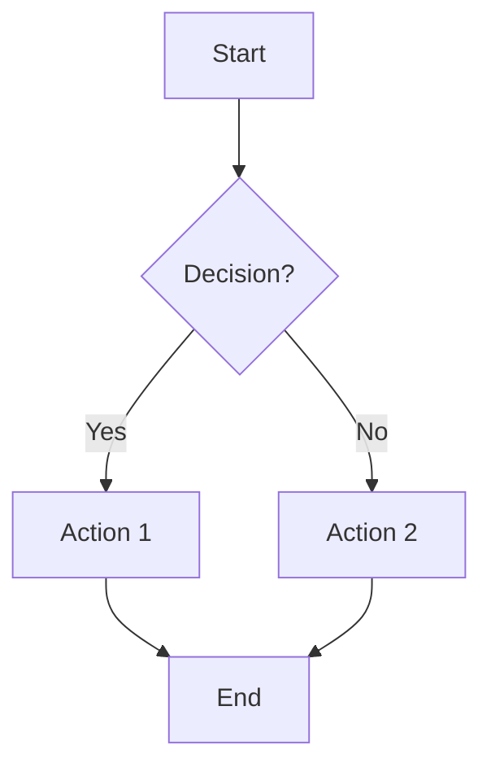
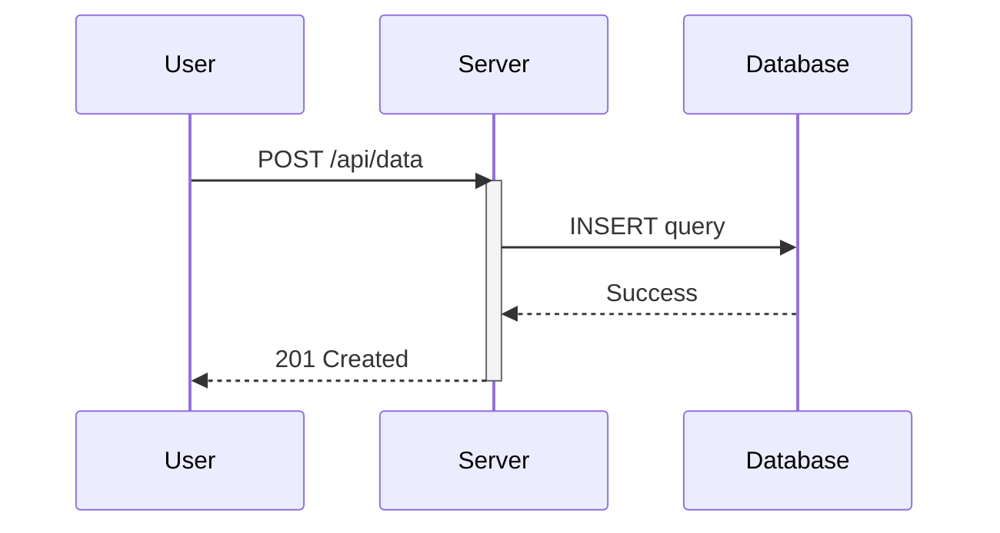
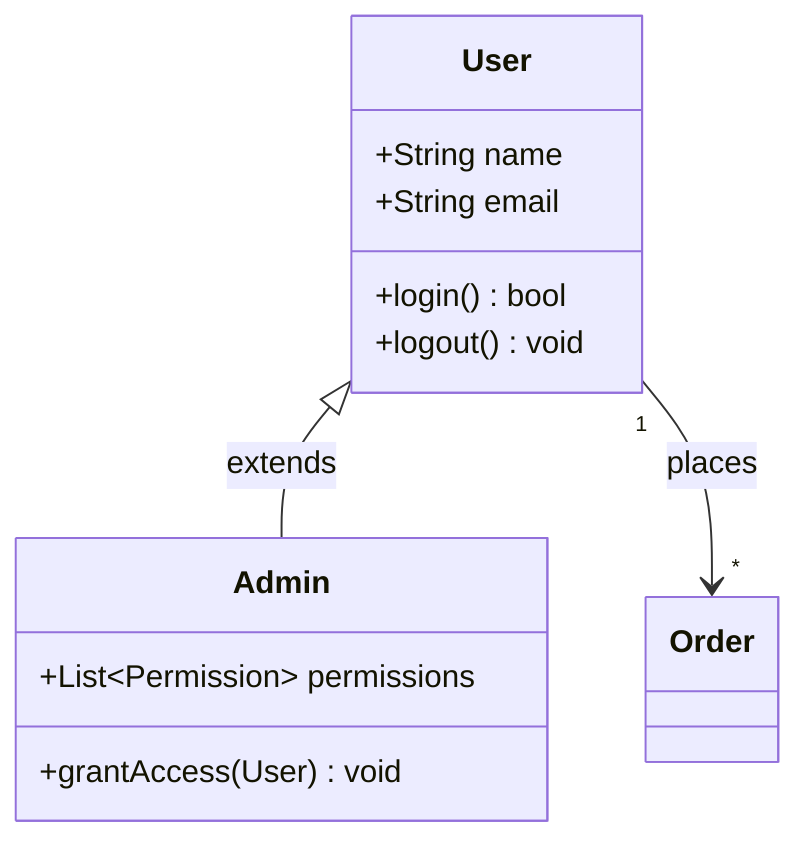
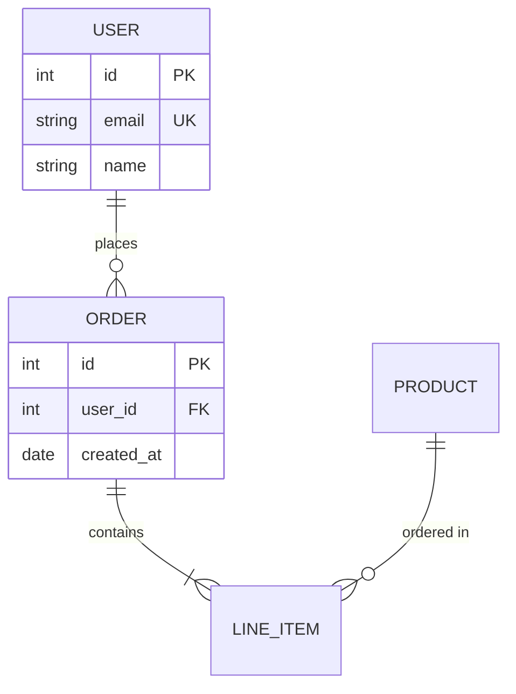
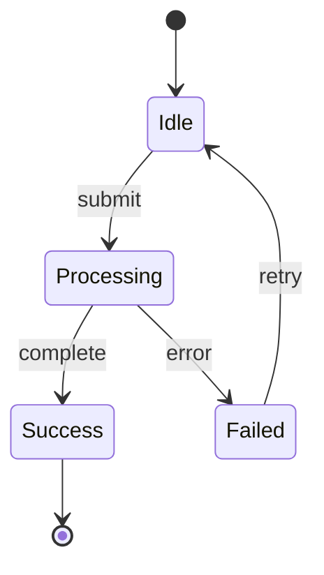
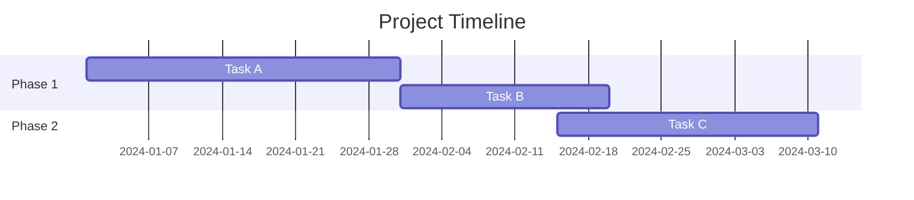
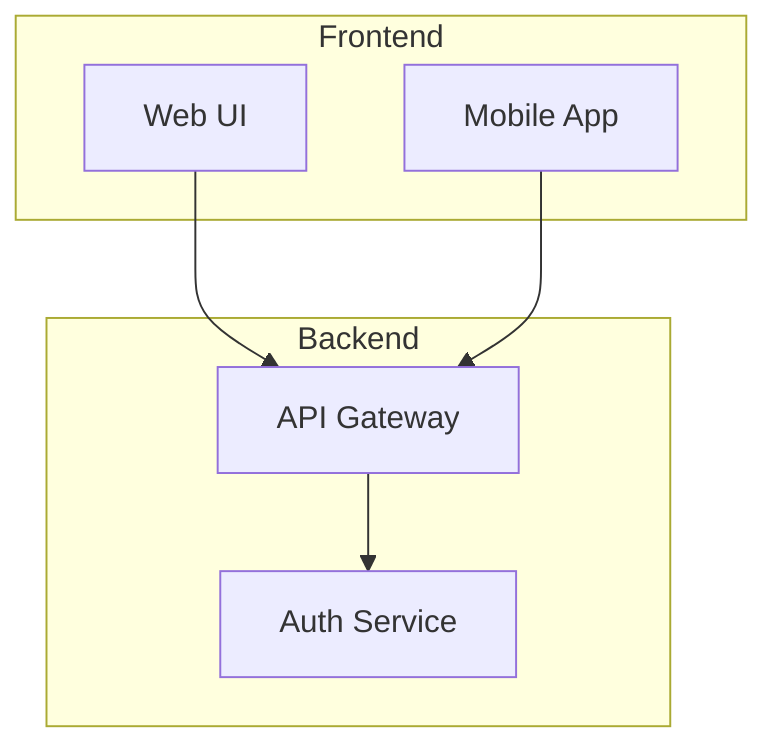
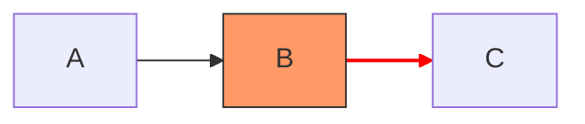

# Mermaid Diagrams Skill

Create Mermaid diagrams that render correctly and communicate clearly.

**Key Feature**: This skill creates **both** `.mermaid` source files AND image files (PNG/SVG/PDF).

## Two-Step Process

Every diagram creation involves:
1. **Create .mermaid file** - Editable source that renders as visual artifact in Claude
2. **Generate image file** - Portable PNG/SVG/PDF using mermaid CLI (**MANDATORY**)

**Never skip the image generation step!** Users need the image file for sharing, documentation, and presentations.

## Workflow

**IMPORTANT**: Always complete ALL steps below. Do not skip image generation.

1. **Identify** the best diagram type for the request
2. **Generate** clean Mermaid syntax following the patterns below
3. **Save** as `.mermaid` file to `/mnt/user-data/outputs/`
4. **Generate image** (PNG by default) using mermaid CLI - **THIS STEP IS MANDATORY**
5. **Verify** both `.mermaid` and image file were created successfully

### Step-by-Step Execution

After creating the `.mermaid` file, you MUST immediately run:

```bash
mmdc -i /mnt/user-data/outputs/diagram-name.mermaid -o /mnt/user-data/outputs/diagram-name.png -b white
```

If `mmdc` is not available, check installation and guide the user to install it.

## Mermaid CLI Setup

### Installation

The mermaid CLI (`@mermaid-js/mermaid-cli`) is required for image generation. Check if it's installed:

```bash
mmdc --version
```

If not installed, install it globally using npm:

```bash
npm install -g @mermaid-js/mermaid-cli
```

Or use npx to run without global installation:

```bash
npx -p @mermaid-js/mermaid-cli mmdc --version
```

### Image Generation

After creating a `.mermaid` file, automatically generate an image:

**PNG (default, good for documentation):**
```bash
mmdc -i /mnt/user-data/outputs/diagram-name.mermaid -o /mnt/user-data/outputs/diagram-name.png
```

**SVG (scalable, best for web):**
```bash
mmdc -i /mnt/user-data/outputs/diagram-name.mermaid -o /mnt/user-data/outputs/diagram-name.svg
```

**PDF (good for print):**
```bash
mmdc -i /mnt/user-data/outputs/diagram-name.mermaid -o /mnt/user-data/outputs/diagram-name.pdf
```

### Configuration Options

**Background color:**
```bash
mmdc -i input.mermaid -o output.png -b white
# or transparent
mmdc -i input.mermaid -o output.png -b transparent
```

**Custom theme:**
```bash
mmdc -i input.mermaid -o output.png -t dark
# themes: default, dark, forest, neutral
```

**Custom size/scale:**
```bash
mmdc -i input.mermaid -o output.png -w 1920 -H 1080
# or use scale factor
mmdc -i input.mermaid -o output.png -s 2
```

**Custom config file:**
```bash
mmdc -i input.mermaid -o output.png -c config.json
```

Example `config.json`:
```json
{
  "theme": "default",
  "themeVariables": {
    "primaryColor": "#ff6b6b",
    "primaryTextColor": "#fff",
    "primaryBorderColor": "#000",
    "lineColor": "#333",
    "secondaryColor": "#4ecdc4",
    "tertiaryColor": "#ffe66d"
  },
  "flowchart": {
    "curve": "basis",
    "padding": 15
  }
}
```

## Diagram Type Selection

| Request Type | Diagram | Direction |
|-------------|---------|-----------|
| Processes, decisions, workflows | `flowchart` | TB or LR |
| API calls, service interactions, time-ordered events | `sequenceDiagram` | (implicit LR) |
| OOP structures, data models, inheritance | `classDiagram` | TB |
| Database schemas, entity relationships | `erDiagram` | (auto) |
| Object lifecycles, FSMs | `stateDiagram-v2` | TB or LR |
| Project timelines, schedules | `gantt` | (implicit LR) |
| Git branches, commits | `gitGraph` | LR |
| Hierarchical data, org charts | `flowchart` with subgraphs | TB |

## Quick Syntax Reference

### Flowchart


Node shapes: `[rect]` `(rounded)` `{diamond}` `([stadium])` `[[subroutine]]` `[(database)]` `((circle))` `>flag]` `{{hexagon}}`

### Sequence Diagram


Arrows: `->>` (solid async), `-->>` (dotted response), `--)` (async no arrow), `-x` (lost message)

### Class Diagram


Relations: `<|--` (inheritance), `*--` (composition), `o--` (aggregation), `-->` (association), `..>` (dependency)

### ER Diagram


Cardinality: `||` (one), `o|` (zero or one), `}|` (one or more), `}o` (zero or more)

### State Diagram


### Gantt Chart


## Best Practices

**Node IDs**: Use meaningful names (`userService`, `validateInput`) not single letters (`A`, `B`).

**Labels**: Keep under 40 characters. Use `<br>` for line breaks in longer text.

**Direction**: Use `TB` (top-bottom) for hierarchies, `LR` (left-right) for sequences/timelines.

**Subgraphs**: Group related nodes to improve readability:


**Styling**: Apply sparingly for emphasis:


## Common Pitfalls

| Issue | Problem | Solution |
|-------|---------|----------|
| Special chars in labels | `(`, `)`, `[`, `]` break parsing | Wrap in quotes: `A["processData()"]` |
| Colons in labels | Interpreted as styling | Escape: `A["Key: Value"]` |
| Long node names | Diagram becomes unreadable | Use short IDs with descriptive labels: `db[(Database)]` |
| Too many nodes | Cluttered, hard to follow | Split into multiple diagrams or use subgraphs |
| Missing quotes | Spaces in labels fail | Always quote multi-word labels |
| Arrow syntax mixing | Different diagrams use different arrows | Check diagram type (flowchart uses `-->`, sequence uses `->>`) |

## Output

**CRITICAL**: Always create BOTH files - never just the .mermaid file alone!

Save diagrams to `/mnt/user-data/outputs/` with both source and rendered formats:

1. **Source file**: `diagram-name.mermaid` (editable source, renders as visual artifact in Claude)
2. **Image file**: `diagram-name.png` (portable image for sharing/documentation) - **REQUIRED**

### Mandatory Image Generation

**You MUST always generate an image file after creating the .mermaid file.**

Default command (PNG with white background):

```bash
mmdc -i /mnt/user-data/outputs/diagram-name.mermaid -o /mnt/user-data/outputs/diagram-name.png -b white
```

**Execution checklist:**
- ✅ Write .mermaid file
- ✅ Run mmdc command to generate PNG
- ✅ Verify both files exist
- ✅ Show user both file paths

**If mmdc command fails:**
1. Check if mmdc is installed: `which mmdc` or `mmdc --version`
2. If not installed, guide user to install: `npm install -g @mermaid-js/mermaid-cli`
3. Retry image generation after installation
4. If still fails, check troubleshooting section below

This provides both the editable source and a portable image for sharing, documentation, or presentation.

### Image Format Selection

Choose the format based on use case:

| Format | Best For | Command |
|--------|----------|---------|
| PNG | Documentation, wikis, quick sharing | `-o diagram.png` |
| SVG | Web, scalable graphics, further editing | `-o diagram.svg` |
| PDF | Print, reports, presentations | `-o diagram.pdf` |

## Troubleshooting Image Generation

### Puppeteer/Chromium Issues

If image generation fails with Puppeteer errors:

```bash
# Install Chromium dependencies (Linux)
sudo apt-get install -y libgbm-dev libxkbcommon-x11-0 libgtk-3-0 libx11-xcb1 libnss3 libxss1 libasound2

# Or use system Chromium (set environment variable)
export PUPPETEER_SKIP_CHROMIUM_DOWNLOAD=true
export PUPPETEER_EXECUTABLE_PATH=/usr/bin/chromium
```

### Permission Errors

If output directory is not writable:

```bash
# Check directory permissions
ls -la /mnt/user-data/outputs/

# Create directory if missing
mkdir -p /mnt/user-data/outputs/
```

### Syntax Errors

If image generation fails, first verify the `.mermaid` file syntax:

1. Check the source `.mermaid` file for syntax errors
2. Test in the [Mermaid Live Editor](https://mermaid.live/)
3. Fix syntax issues and regenerate image

### Large Diagrams

For very large or complex diagrams:

```bash
# Increase viewport size
mmdc -i input.mermaid -o output.png -w 3840 -H 2160

# Increase scale for better quality
mmdc -i input.mermaid -o output.png -s 3

# Use SVG for infinite scaling
mmdc -i input.mermaid -o output.svg
```

## Complete Example Workflow

Here's exactly what you should do when a user asks for a diagram:

**User request**: "Create a flowchart showing the authentication process"

**Your actions**:

1. **Create the .mermaid file**:
```bash
# Write the mermaid content to file
cat > /mnt/user-data/outputs/auth-flow.mermaid << 'EOF'
flowchart TB
    Start[User Login] --> ValidateInput{Valid Credentials?}
    ValidateInput -->|Yes| CheckDB[Query Database]
    ValidateInput -->|No| Error[Show Error]
    CheckDB --> UserExists{User Exists?}
    UserExists -->|Yes| GenerateToken[Generate JWT Token]
    UserExists -->|No| Error
    GenerateToken --> Success[Login Success]
    Error --> End[End]
    Success --> End
EOF
```

2. **Generate the PNG image**:
```bash
# MANDATORY: Generate image from .mermaid file
mmdc -i /mnt/user-data/outputs/auth-flow.mermaid -o /mnt/user-data/outputs/auth-flow.png -b white
```

3. **Verify and inform user**:
```bash
# Check both files exist
ls -lh /mnt/user-data/outputs/auth-flow.*

# Output to user:
# ✅ Created auth-flow.mermaid (source file)
# ✅ Created auth-flow.png (image file - 45 KB)
```

**What NOT to do**:
- ❌ Create only the .mermaid file and stop
- ❌ Tell the user to run mmdc themselves
- ❌ Skip image generation because you think it's optional
- ❌ Forget to verify both files were created

**If mmdc is not installed**:
1. Check: `which mmdc`
2. If not found, inform user: "mmdc not found. Installing mermaid CLI..."
3. Guide installation: `npm install -g @mermaid-js/mermaid-cli`
4. Retry image generation after installation

## Quick Pre-Flight Check

Before creating any diagram, verify mermaid CLI is available:

```bash
# Check if mmdc is installed
mmdc --version
```

If this succeeds, proceed with diagram creation. If it fails, install mermaid CLI first.

For detailed syntax reference and advanced patterns, see [references/syntax-guide.md](references/syntax-guide.md).
